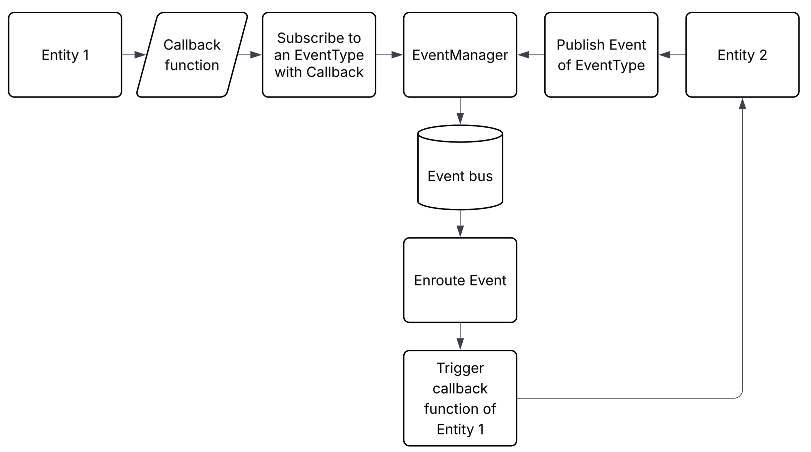

# Eventos

Un evento es un cambio de estado en el sistema que puede ser causado por una acción del usuario o por el sistema mismo. Los eventos son fundamentales para la interacción en tiempo real entre las distintas partes del motor y las entidades que lo componen.
El motor utiliza un sistema EDA (Event-Driven Architecture) para manejar los eventos. Se trata de un paradigma en el que las distintas partes del sistema se comunican preoduciendo y respondiendo a eventos en tiempo real. 
Esto permite una mayor flexibilidad y escalabilidad en la arquitectura del motor.

Diagrama de la arquitectura EDA en el motor con un ejemplo de 2 [`Entity`](entity.md):


- Para que se puedan recibir llamados ([`EventCallback`](#eventcallback)) de cualquier tipo de evento [`EventType`](#eventtype), debe suscrbirse a través de [`EventManager::subscribe()`](#eventmanager), pasándo como argumento el [`EventType`](#eventtype) 
al que desea suscribirse y una función [`EventCallback`](#eventcallback) que se ejecutará cuando se produzca el evento, el [`EventManager`](#eventmanager) se encargará de agregar la función a la lista de callbacks del tipo de evento correspondiente ([`EventBus`](#eventbus)).
- Para que se puedan producir eventos de un [`EventType`](#eventtype) específico, debe publicar el [`Event`](#event) correspondiente a través de [`EventManager::publish()`](#eventmanager), éste se encargará de enrutar el [`Event`](#event) al elemento en el [`EventBus`](#eventbus) correspondiente, 
lo cuál ejecutará el o los [`EventCallback`](#eventcallback) de los suscriptores.

## Estructuras de tipos de eventos

### EventType
Un `EventType` es una enumeración que define los distintos tipos de eventos que pueden ocurrir en el sistema. Cada tipo de evento representa un cambio de estado o una acción específica que puede ser relevante para las entidades del motor. Lo tipos de evento están clasificados en diferentes categorías, 
como eventos del sistema, de entrada, de física y de entidades.
```cpp
	enum class EventType
	{
		// System events
		WINDOW_CLOSED,
		WINDOW_RESIZED,
		WINDOW_LOST_FOCUS,
		WINDOW_GAINED_FOCUS,

		// Input events
		KEY_PRESSED,
		KEY_RELEASED,
		MOUSE_BUTTON_PRESSED,
		MOUSE_BUTTON_RELEASED,
		MOUSE_MOVED,

		// Physics events
		COLLISION,
		TRIGGER_ENTER,
		TRIGGER_EXIT,

		// Entity events
		ENTITY_CREATED,
		ENTITY_DESTROYED,

		// Custom direct events
		MESSAGE,

		// Custom global events
		GLOBAL_MESSAGE,
	};
```
### EventCategory
A pesar de que todos los eventos de todas las categorías están definidos en la misma `enum class`, existe otra `enum class` que define las categorías de los eventos, para poder filtrar los eventos por categoría.
```cpp
	enum class EventCategory
	{
		SYSTEM_EVENT,
		INPUT_EVENT,
		PHYSICS_EVENT,
		ENTITY_EVENT,
		CUSTOM_DIRECT_EVENT,
		CUSTOM_GLOBAL_EVENT
	};
```
### EventTypeInfo
Este `struct` contiene información sobre donde termina cada categoría de eventos dentro de `EventType` y la cantidad de elementos en total de `EventType`. Esto es útil para filtrar los eventos por categoría y enrutar.
```cpp
	struct EventTypeInfo
	{
		static const EventType system_end = EventType::WINDOW_GAINED_FOCUS;
		static const EventType input_end = EventType::MOUSE_MOVED;
		static const EventType physics_end = EventType::TRIGGER_EXIT;
		static const EventType entity_end = EventType::ENTITY_DESTROYED;
		static const EventType custom_end = EventType::MESSAGE;
		static const EventType custom_global_end = EventType::GLOBAL_MESSAGE;
		static const size_t size = static_cast<size_t>(custom_global_end) + 1;
	};
```
<span style="color:red">NOTA</span>: si se desea agregar un nuevo `EventType`, se debe agregar en el orden correcto dentro de la `enum class` y actualizar el `EventTypeInfo` para que refleje los cambios en caso de que se modifique el último elemento de la categoría.

## Event

Un `Event` es el núcleo del sistema de eventos. Representa un cambio de estado o una acción que ha ocurrido en el sistema. Cada `Event` está asociado a un `EventType` y puede contener datos adicionales relevantes para el evento en `data`.
```cpp
	class Event
	{
	protected:

		EventType type;
		EventData data;

	public:

		Event(EventType event_type);
		Event(EventType event_type, EventData _data);
		EventCategory get_event_category() const;
		EventType get_event_type() const;

		template<typename T>
		T get_data() const;
	};

```

### Funciones de `Event`

#### Contructores

```cpp
	Event(EventType event_type);
	Event(EventType event_type, EventData _data);
```
Estos constructores permiten crear un `Event` con un tipo específico y opcionalmente con datos adicionales. El primer constructor solo requiere el `EventType`, mientras que el segundo permite pasar un [`EventData`](#eventdata) adicional.

#### `get_event_category`
```cpp
	EventCategory Event::get_event_category() const
{
	if (type < EventTypeInfo::custom_end)
	{
		return EventCategory::SYSTEM_EVENT;
	}
	else if (type < EventTypeInfo::input_end)
	{
		return EventCategory::INPUT_EVENT;
	}
	else if (type < EventTypeInfo::physics_end)
	{
		return EventCategory::PHYSICS_EVENT;
	}
	else if (type < EventTypeInfo::entity_end)
	{
		return EventCategory::ENTITY_EVENT;
	}
	else if (type < EventTypeInfo::custom_end)
	{
		return EventCategory::CUSTOM_DIRECT_EVENT;
	}
	else
	{
		return EventCategory::CUSTOM_GLOBAL_EVENT;
	}
}
```
Función que devuelve la categoría del evento. Utiliza el `EventType` del evento para determinar a qué categoría pertenece, basándose en los límites definidos en `EventTypeInfo`.

#### `get_event_type`
```cpp
	EventType Event::get_event_type() const
{
	return type;
}
```
Función que devuelve el tipo de evento. Simplemente retorna el `EventType` del evento.

#### `get_data`
```cpp
	template<typename T>
	T Event::get_data() const
	{
		return std::get<T>(data);
	}
```
Función plantilla que permite obtener los datos del evento en un tipo específico. Utiliza `std::get` para extraer el dato del [`EventData`](#eventdata), que es un `std::variant` que puede contener diferentes tipos de datos.

## EventManager

El `EventManager` es el componente central del sistema de eventos. Se encarga de gestionar la suscripción y publicación de eventos, así como de enrutar los eventos a los suscriptores correspondientes. Utiliza un [`EventBus`](#eventbus) para almacenar las funciones callback asociadas a cada tipo de evento.
```cpp
	class EventManager
	{
	protected:

		static EventBus event_bus;

		EventManager();

	public:

		static void suscribe(Actor self, EventType event_type, EventCallback callback);
		static bool desuscribe(Actor self, EventType event_type);
		static void publish(const Event& event);
		static void publish(const Event& event, Actor target);
	};
```

### Funciones de `EventManager`

#### `suscribe`
```cpp
	void EventManager::suscribe(Actor self, EventType event_type, EventCallback callback)
	{
		event_bus[static_cast<size_t>(event_type)][self] = callback;
	}
```
Función que permite a un [`Actor`](#actor) suscribirse a un tipo específico de evento. Agrega la función [`callback`](#eventcallback) al [`EventBus`](#eventbus) bajo el `EventType` correspondiente y el actor que se suscribe.

#### `desuscribe`
```cpp
	bool EventManager::desuscribe(Actor self, EventType event_type)
	{
		auto& callbacks = event_bus[static_cast<size_t>(event_type)];
		auto it = callbacks.find(self);
		if (it != callbacks.end())
		{
			callbacks.erase(it);
			return true;
		}
		return false;
	}
```
Función que permite a un [`Actor`](#actor) desuscribirse de un tipo específico de evento. Busca el [`Actor`](#actor) en el [`EventBus`](#eventbus) bajo el `EventType` correspondiente y lo elimina si se encuentra. Retorna `true` si se desuscribió correctamente, o `false` si el actor no estaba suscrito. Es importante
implementar esta función en el destructor del objeto que estamos suscribiendo a eventos para evitar fugas de memoria y mantener el [`EventBus`](#eventbus) limpio.

#### `publish`
```cpp
	switch (event.get_event_category())
	{
		case EventCategory::SYSTEM_EVENT:
		case EventCategory::INPUT_EVENT:
		case EventCategory::ENTITY_EVENT:
		case EventCategory::CUSTOM_GLOBAL_EVENT:

			for (const auto& callback : event_bus[static_cast<size_t>(event.get_event_type())])
			{
				callback.second(event);
			}

			break;

		default:
			std::cerr << "Error: Event type does need target argument." << std::endl;
			break;
	}
```
Función que permite publicar y enrutar un `Event` a todos los suscriptores del `EventType` correspondiente. Recorre el [`EventBus`](#eventbus) y ejecuta las funciones [`callback`](#eventcallback) de todos los [`Actor`](#actor) suscritos al tipo de evento.

```cpp
	void EventManager::publish(const Event& event, Actor target)
	{
		auto& callbacks = event_bus[static_cast<size_t>(event.get_event_type())];
		auto it = callbacks.find(target);
		if (it != callbacks.end())
		{
			it->second(event);
		}
	}
```
Función que permite publicar y enrutar un `Event` a un [`Actor`](#actor) específico. Busca el [`Actor`](#actor) en el [`EventBus`](#eventbus) bajo el `EventType` correspondiente y ejecuta su función [`callback`](#eventcallback) si se encuentra. Esto es útil para eventos que solo deben ser manejados por un [`Actor`](#actor) específico.

## Tipos de datos de eventos

Los tipos de datos de eventos son estructuras que contienen información adicional relevante para ciertos tipos de eventos. Estos datos se almacenan en el `Event` y pueden ser accedidos por los suscriptores a través de la función `get_data`.
Es posible agregar más tipos de datos según sea necesario, dependiendo de los eventos que se manejen en el sistema, pero es importente agregarlos dentro de [`EventData`](#eventdata).

#### `EmptyEvent`
```cpp
	struct EmptyEvent {};
```
Un `EmptyEvent` es una estructura vacía que se utiliza como un tipo de dato para eventos que no requieren información adicional. Se puede utilizar en situaciones donde solo se necesita notificar que un evento ha ocurrido sin necesidad de pasar datos adicionales.
#### `EntityEvent`
```cpp
	struct EntityEvent
	{
		std::shared_ptr<Entity> entity;
	};
```
Un `EntityEvent` es una estructura que contiene un puntero compartido a una entidad [`Entity`](entity.md). Se utiliza para eventos que están relacionados con entidades específicas en el motor, permitiendo que los suscriptores accedan a la entidad asociada al evento.

## Definiciones de tipos y alias

#### `EventCallback`
```cpp
	using EventCallback = std::function<void(const Event&)>;
```
Un alias para una función que toma un `Event` como argumento y no retorna nada. Se utiliza para definir las funciones de [`callback`](#eventcallback) que se ejecutarán cuando se produzca un evento.
#### `Actor`
```cpp
	using Actor = std::variant<std::shared_ptr<sf::RenderWindow>, std::shared_ptr<Entity>>;
```
Un alias para un `std::variant` que puede contener un puntero compartido a una ventana de renderizado (`sf::RenderWindow`) o a una entidad (`Entity`). Esto permite que el `EventManager` maneje eventos tanto para la ventana de renderizado como para las entidades del motor. Se
pueden agregar más tipos de [`Actor`](#actor) en el futuro si es necesario.
#### `EventData`
```cpp
	using EventData = std::variant<
							EmptyEvent,
							EntityEvent>;
```
Un alias para un `std::variant` que puede contener diferentes tipos de datos asociados a un evento. En este caso, contiene `EmptyEvent` y `EntityEvent`, pero se pueden agregar más tipos de datos según sea necesario. Esto permite que los eventos transporten información adicional relevante para el evento en cuestión.
<span style="color:red">NOTA</span>: si se desea agregar un nuevo tipo de dato, se debe agregar dentro del `std::variant`.
#### `EventBus`
```cpp
	using EventBus = std::array<std::unordered_map<Actor, EventCallback>, EventTypeInfo::size>;
```
Un alias para un `std::array` que contiene `std::unordered_map` donde la clave es un [`Actor`](#actor) y el valor es un `EventCallback`. Cada índice del array corresponde a un `EventType`, lo que permite almacenar las funciones de callback para cada tipo de evento. Esto facilita la suscripción y publicación de eventos.