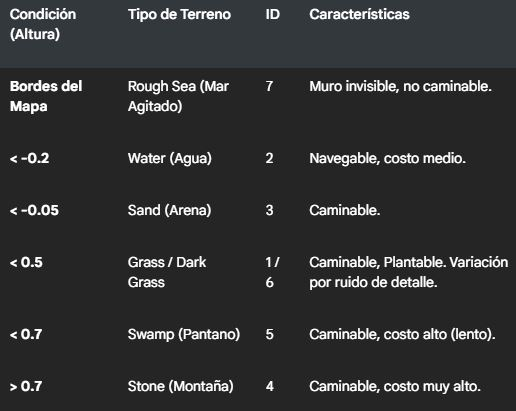

Map Generator
=============

Este archivo define la clase estática MapGenerator, encargada de la creación procedimental de terrenos utilizando algoritmos de ruido (Noise). Permite generar mapas variados y guardarlos en archivos binarios para su uso posterior en la simulación.

Estructuras de Datos
--------------------

### struct CellData

Representa la información de una única celda en el mapa.

*   **Datos:** Tipo, id de textura, costo de esfuerzo (peso).
    
*   **Flags:** is\_walkable, is\_navigable, is\_plantable.
    

### struct Config

Contenedor de parámetros para personalizar la generación:

*   **Dimensiones:** width, height.
    
*   **Ruido:** seed, frequency (zoom), octaves (rugosidad).
    
*   **Detalle:** detail\_freq (para variaciones secundarias como hierba oscura).
    
*   **Salida:** filename (nombre del archivo .zadat).
    

Clase MapGenerator
------------------

### Método Principal

*   **static void generate\_map(const Config& config)**
    
    *   **Descripción:** Ejecuta el algoritmo de generación y guarda el resultado en disco.
        

### Flujo de Generación

1.  **Inicialización de Ruido:**
    
    *   Se configura una instancia de FastNoiseLite (OpenSimplex2) para la elevación base.
        
    *   Se configura una segunda instancia (Perlin) para detalles de variación (ej. parches de vegetación).
        
2.  

    
3.  **Exportación Binaria (.zadat):**
    
    *   El mapa se guarda en formato binario crudo para una carga rápida.
        
    *   **Cabecera:** Ancho (uint16), Alto (uint16).
        
    *   **Cuerpo:** Array de estructuras CellData.